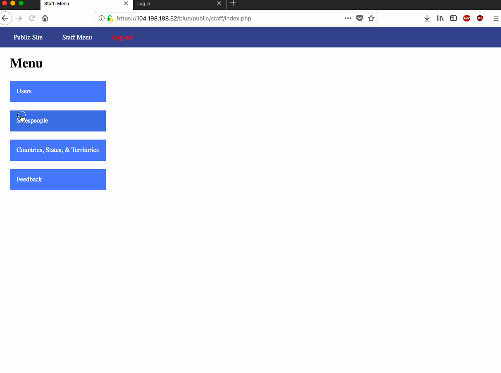

# Project 8 - Pentesting Live Targets

Time spent: 4 hours spent in total

> Objective: Identify vulnerabilities in three different versions of the Globitek website: blue, green, and red.

The six possible exploits are:
* Username Enumeration
* Insecure Direct Object Reference (IDOR)
* SQL Injection (SQLi)
* Cross-Site Scripting (XSS)
* Cross-Site Request Forgery (CSRF)
* Session Hijacking/Fixation

Each version of the site has been given two of the six vulnerabilities. (In other words, all six of the exploits should be assignable to one of the sites.)

## Blue

### Vulnerability #1: SQLi in public "Find a Salesperson" view

Note, recording was made in a private view, but exact same exploit is available via the public "Find a Salesperson" view.

### Vulnerability #2: Session Hijacking

## Green

### Vulnerability #1: User Enumeration (Valid user is bold, invalid user is not)

### Vulnerability #2: XSS via Contact From

## Red

### Vulnerability #1: IDOR in Public "Find a Salesperson" view

### Vulnerability #2: CSRT Forgery - Not being checked in private "Users -> Edit" view.

